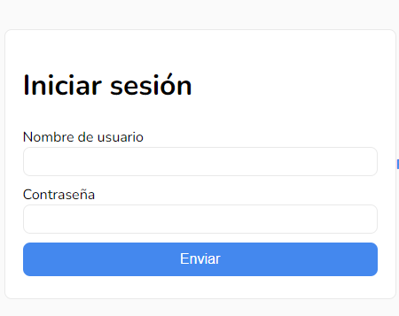
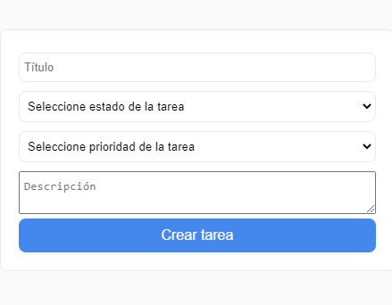
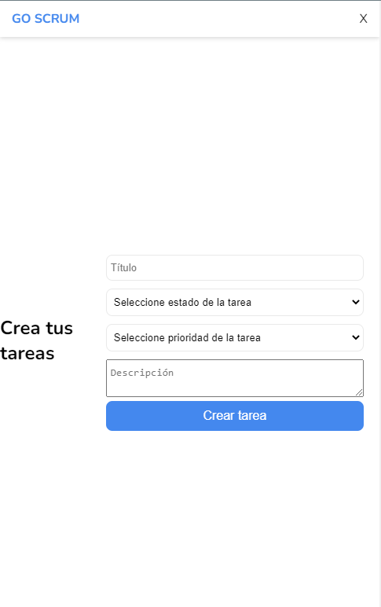
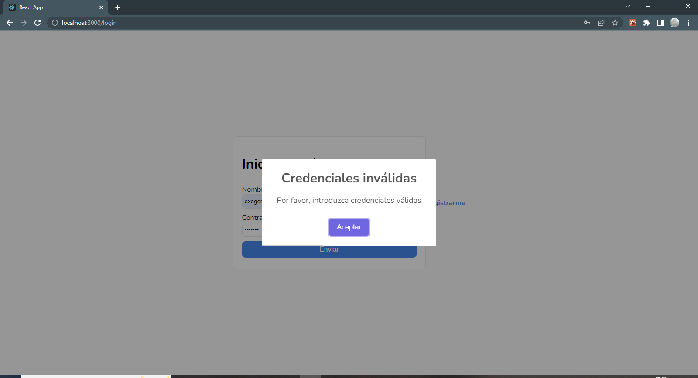
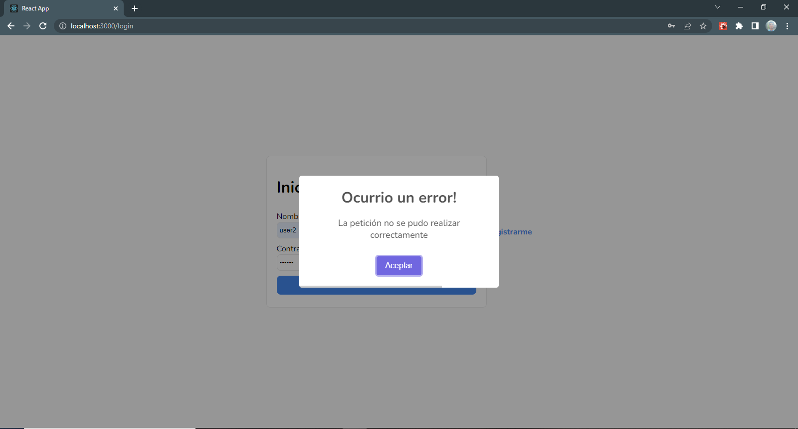
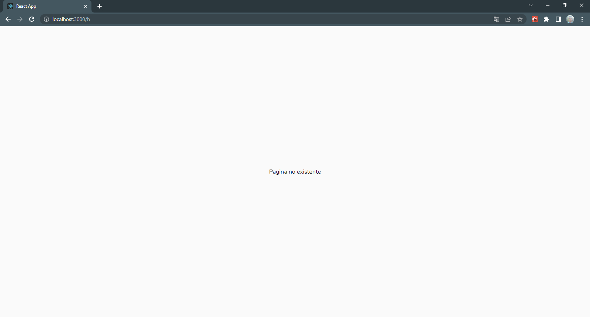

# Proyecto GoScrum | Challenge Alkemy 🧑‍🔧
---
## 🖥️ Tecnologías Utilizadas:

- Mobile First
- Formik, Yup
- React Router Dom V6
- Framer Motion
- Postman, UUID, Material UI
- React-toastify, SweetAlert2, React Loading Skeleton
- Redux
- Testing Library, Mock Service Worker
- SDKs  
---
## Comandos 🧑‍💻

### Instalar dependencias

npm install

---

---

---

---

---

---

---

---

## 🔍 Recursos de la API

Con la siguiente URL podrán acceder a la API pública del proyecto → 
### [Ver Pagina](https://goscrum-api.alkemy.org/) 👈

En el siguiente link podrán acceder a la Colección para Postman → 
### [Ver Pagina](https://drive.google.com/file/d/1ct4hRm_3jkYGXGTjQhhp0I8zWOYVnhnF/view/) 👈 

#### ⚠️ IMPORTANTE: Es necesario reemplazar en cada request de Postman localhost por la URL de la API ⚠️
---
## ⬇️ Download

### Cómo descargar:

#### 🔹 Fork

1 - Haz el <strong>fork</strong> del proyecto. En la parte superior derecha, al hacer clic en el icono se creará un repositorio del proyecto en tu cuenta personal de GitHub.  

     

2 - Una vez que tengas el repositorio "forkado" en tu cuenta, comprueba si la URL de la página es la del repositorio de tu cuenta.

     

3 - Haz clic en la opción <strong>Code</strong>. Se mostrarán tres formas de instalar el repositorio en su máquina, y destacamos dos:

     

 

#### 🔹 Clonar o descargar el ZIP

1 - Para clonar, simplemente copia el <em>url</em> resaltado en la imagen y ubicado justo debajo del HTTPS, crea una carpeta en tu computadora, abre el <em>cmd</em> o el <em>git bash</em> dentro de esa carpeta y luego ingresa el comando <strong>git clone</strong> y con el botón derecho del mouse dentro del terminal haz click en la opcion <strong>Paste</strong> para pegar el <em>url</em> y presiona <em>Enter</em>. 

     

2 - La segunda opción es descargar el código en un paquete <strong>"zipado"</strong> y extraer la carpeta a tu computadora.
